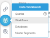
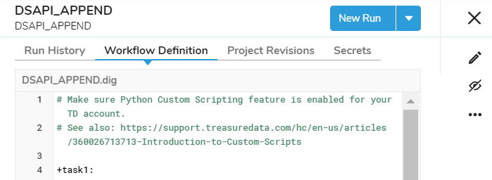
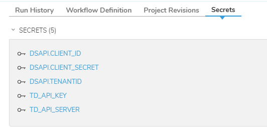

# Acxiom Data Services (DS-API) Integration

## Integration Overview

The Acxiom data services API (DS-API) provides a common interface to access Acxiom's core data products which include:

* Name and address standardisation and parsing
* Matching customer PII to Acxiom's data products and enrichment
* 1st party identity resolution through Acxiom's Identity Builder

The following guide covers the integration of a Treasure Data workflow with Acxioms DS-API.


# Pre-requisites

1. Login access to Treasure Data console. [https://console.treasuredata.com/app](https://console.treasuredata.com/app)

2. A Login account on Acxiom Developer DS-API console. Register here [https://developer.myacxiom.com](https://developer.myacxiom.com/)

3. Add an 'Application Name' in the DS-API Developer console to create an API Key (DSAPI.CLIENT_ID) and API Secret (DSAPI.CLIENT_SECRET)


4. A Treasure Data API key with Master Access:


## Source data preparation

1. If required, create a new database via the TD console using the  menu option and pressing the   button.
2. Upload PII data to database using the Integration -> Sources screen. Click on the  button. The data must contain an identity field.
   


## Add enrichment workflow

1. Add a workflow template and click the Workflows menu:



2. Under workflow definition, click on edit workflow:



3. Next add in the Python scripts and paste the template code from GIT: 


4. Next add in the secrets:



Note: Leave DSAPI.TENANTID=empty for the US Synthetic data.

## Configuring the Enrichment Flow

### Set input mapping rules

The input PII mapping rules are stored in the python script mappings.py.

The script contains mapping rules specified for each DS-API request field. The rules are specified using SQL functions as you would use in a SQL selected statement.

For example:

**mapping.py**
```python
source_mapping = {
    'id': 'customer_id',
    'firstName': 'first_name',
    'middleName': 'middle_name',
    'lastName': 'last_name',
    'streetAddress': """Coalesce(
                  Coalesce(primarynumber, '')||
                  Coalesce(' ' || predirectional, '')||
                  Coalesce(' ' || street, '')||
                  Coalesce(' ' || streetsuffix, '')||
                  Coalesce(' ' || postdirectional, '')||
                  Coalesce(' ' || unitdesignator, '')||
                  Coalesce(' ' || secondarynumber, ''),
                '')""",
        'city': 'city',
        'state': 'state',
        'zipCode': 'truncate(zipcode)'
        }
```

The DS-API fields are documented in developer.myacxiom.com.

### Set the runtime parameters in the DigDag
```digdag
# Make sure Python Custom Scripting feature is enabled for your TD account.
# See also: https://support.treasuredata.com/hc/en-us/articles/360026713713-Introduction-to-Custom-Scripts
 
+task1:
  py>: acxiom_dsapi.bundle_append
  _env:
    DSAPI_OAUTH_ENDPOINT: 'https://api.acxiom.com/api/v1'
    DSAPI_OAUTH_METHOD: '/auth/oauth2/token'
    DSAPI_OAUTH_SCOPE: ''
    DSAPI_OAUTH_GRANT_TYPE: 'client_credentials'
    DSAPI_OAUTH_USERNAME: ''
    DSAPI_OAUTH_PASSWORD: ''
    DSAPI_CLIENT_ID: ${secret:DSAPI.CLIENT_ID}
    DSAPI_CLIENT_SECRET: ${secret:DSAPI.CLIENT_SECRET}
    DSAPI_TENANTID: ''
    DSAPI_ROLE: ''
    DSAPI_MATCH_ENDPOINT: 'https://test.api.acxiom.com/v1'
    DSAPI_MATCH_METHOD: '/person/match'
    DSAPI_MATCH_OPTIONS: ''
    # 0 no debug information returned, >1 PII returned in log, 9 max forced input 1 rec
    DSAPI_DEBUG_LEVEL: 0
    DATABASE_NAME: 'dsapi_synthetic'
    SOURCE_TABLE: 'raw_synth_pii'
    DEST_TABLE: 'dsapi_enhanced_demo_7'
     
    TD_API_KEY: ${secret:TD_API_KEY}
    TD_API_SERVER: ${secret:TD_API_SERVER}
   
  bundles: ''
  enginename: 'presto' 
  max_recs_to_process: 500
  api_batch_limit: 100
  docker:
     image: "digdag/digdag-python:3.7"
 ```


